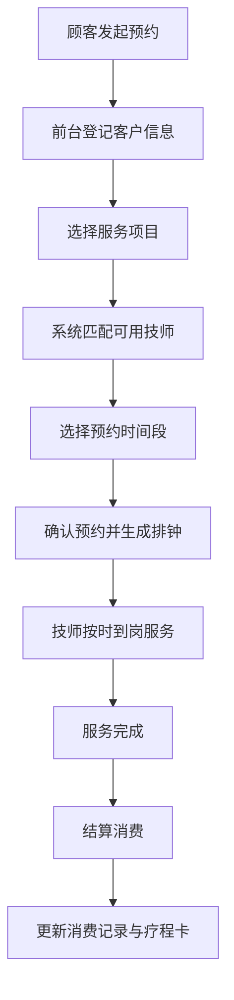
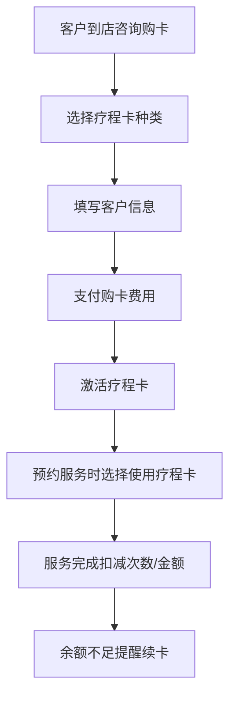

# 理疗馆预约排钟系统 - 产品需求文档 (PRD)

## 1. 产品概述

理疗馆预约排钟系统是专为传统理疗馆、养生馆、按摩店设计的一站式业务管理系统。系统集成项目管理、技师排班、顾客预约、疗程卡管理、消费记录五大核心功能，帮助理疗馆实现数字化运营，提升服务效率与客户体验。

- 目标用户：理疗馆经营者、前台接待、技师、管理人员
- 核心价值：简化预约流程、优化排班效率、精准客户管理、清晰财务追踪

## 2. 核心功能

### 2.1 用户角色

| 角色 | 说明 | 核心权限 |
|------|------|----------|
| 管理员 | 店主/经理 | 全部功能权限，包括系统配置、数据统计 |
| 前台 | 接待人员 | 预约管理、客户登记、消费结算、疗程卡销售 |
| 技师 | 理疗服务人员 | 查看个人排班、查看服务任务、更新服务状态 |

### 2.2 功能模块

1. **首页仪表盘**：今日预约概览、营业统计、待办提醒、快捷操作入口
2. **项目管理**：理疗项目分类、项目详情、价格设置、时长管理
3. **技师排班**：技师档案、班次设置、周/月排班视图、技师状态管理
4. **顾客预约**：预约登记、排钟分配、预约状态跟踪、到店提醒
5. **疗程卡管理**：卡种配置、购卡办理、使用记录、余额查询、过期提醒
6. **消费记录**：消费流水、账单详情、收入统计、分类汇总

### 2.3 页面详情

| 页面名称 | 模块名称 | 功能描述 |
|----------|----------|----------|
| 首页仪表盘 | 数据概览卡片 | 显示今日预约数、在店顾客、今日营收、待服务数 |
| 首页仪表盘 | 今日时间轴 | 按时间线展示全天预约安排 |
| 首页仪表盘 | 快捷操作 | 新建预约、添加客户、快速排班的快捷入口 |
| 项目管理 | 项目列表 | 展示所有理疗项目，支持按分类筛选、搜索 |
| 项目管理 | 项目表单 | 新增/编辑项目：名称、分类、时长、价格、描述、适用技师 |
| 项目管理 | 分类管理 | 项目分类的增删改 |
| 技师排班 | 排班日历 | 周/月视图展示技师排班，支持拖拽调整 |
| 技师排班 | 技师列表 | 展示技师档案：姓名、工号、擅长项目、状态、联系方式 |
| 技师排班 | 班次配置 | 早班/中班/晚班/休息的班次时间设置 |
| 顾客预约 | 预约列表 | 按日期展示预约，支持状态筛选（待确认/已确认/进行中/已完成/已取消） |
| 顾客预约 | 预约登记表单 | 选择客户/新客户登记、选择项目、选择技师、选择时间段、备注 |
| 顾客预约 | 预约详情 | 展示预约完整信息、状态变更操作 |
| 疗程卡管理 | 卡种列表 | 展示疗程卡配置：卡名、次数/时长、价格、有效期、适用项目 |
| 疗程卡管理 | 购卡办理 | 选择客户、选择卡种、支付方式、开卡登记 |
| 疗程卡管理 | 客户卡片 | 展示客户名下所有疗程卡及使用详情 |
| 消费记录 | 流水列表 | 展示所有消费记录，支持日期/类型/支付方式筛选 |
| 消费记录 | 消费详情 | 展示账单明细：项目、技师、金额、优惠、支付方式 |
| 消费记录 | 统计图表 | 按日/周/月的营收趋势图、项目销量排行 |

## 3. 核心流程

### 3.1 顾客预约服务流程

顾客通过电话或到店预约，前台在系统中登记预约信息，系统自动匹配可用技师并排班，服务完成后结算并记录消费。

### 3.2 疗程卡使用流程

## 4. 用户界面设计

### 4.1 设计风格

**设计理念：东方禅意 + 现代简约**

理疗馆属于养生健康行业，整体设计应传递宁静、舒适、专业的氛围，融合东方传统美学与现代交互体验。

- **主色调**：
  - 主色：深檀木色 `#6B4423`（沉稳、专业）
  - 辅色：玉石绿 `#5B8C5A`（健康、自然）
  - 点缀色：暖金色 `#C9A961`（品质、尊贵）
  - 背景色：米色 `#FAF7F2`（柔和、舒适）
  - 文字色：墨灰 `#2D2A26`（清晰、易读）

- **按钮样式**：
  - 主按钮：圆角矩形（8px），深檀木色填充，悬停时微亮渐变
  - 次按钮：圆角描边按钮，玉石绿色描边
  - 点击反馈：微缩放 + 阴影变化

- **字体选型**：
  - 标题字体：思源宋体（Source Han Serif CN），传递传统典雅气质
  - 正文字体：思源黑体（Source Han Sans CN），保证可读性
  - 字号层级：H1(28px) / H2(22px) / H3(18px) / 正文(14px) / 辅助(12px)

- **布局风格**：
  - 左侧侧边栏导航 + 右侧内容区的经典后台布局
  - 卡片式内容容器，浅色背景 + 柔和阴影
  - 充足留白，营造宁静呼吸感

- **图标风格**：
  - 线性图标为主，统一 1.5px 描边
  - 关键节点使用填充图标增强识别
  - 融入中式元素（如祥云、竹叶纹样作为装饰）

### 4.2 页面设计概览

| 页面名称 | 模块名称 | UI 元素 |
|----------|----------|---------|
| 首页仪表盘 | 数据概览卡片 | 渐变背景卡片，数据数字大字号展示，图标 + 数据左右布局，底部趋势小箭头 |
| 首页仪表盘 | 今日时间轴 | 垂直时间轴，节点状态用颜色区分（待确认=橙色/进行中=玉石绿/已完成=灰色） |
| 首页仪表盘 | 快捷操作 | 圆角方形按钮，图标在上文字在下，悬停上浮效果 |
| 项目管理 | 项目列表 | 表格布局，斑马条纹，操作列悬浮按钮，分类标签用彩色胶囊 |
| 项目管理 | 项目表单 | 分区分组表单，左侧标签右侧输入，必填项红星标识 |
| 技师排班 | 排班日历 | 网格布局，行=技师，列=日期/时段，单元格可点击编辑，不同班次颜色区分 |
| 技师排班 | 技师卡片 | 头像 + 姓名工号 + 擅长标签，状态徽章（在岗/休息/请假） |
| 顾客预约 | 预约列表 | 卡片分组，每组对应一个日期，卡片内显示客户名 + 项目 + 时间段 + 状态徽章 |
| 顾客预约 | 预约表单 | 分步表单：选客户 → 选项目 → 选技师时段 → 确认，顶部进度条 |
| 疗程卡管理 | 卡种展示 | 卡片式设计，卡面渐变 + 烫金边效果，突出卡名和价格 |
| 疗程卡管理 | 客户卡片 | 列表展示卡片进度条（已用次数/总次数），到期日高亮提醒 |
| 消费记录 | 流水列表 | 紧凑表格，金额列右对齐，正负金额颜色区分，支持展开详情 |
| 消费记录 | 统计图表 | 折线图展示营收趋势，柱状图展示项目销量，配色与主色调统一 |

### 4.3 响应式设计

- **设计优先**：桌面端优先（最小支持 1280px 宽度）
- **平板适配**：侧边栏可折叠为图标模式，内容区自适应
- **手机适配**：底部 Tab 导航替代侧边栏，表格转为卡片列表展示，重要信息优先显示
- **触控优化**：按钮最小触控区域 44px，列表项间距 ≥ 8px

### 4.4 交互动效

- 页面切换：淡入 + 轻微上移动画（duration: 300ms, ease: ease-out）
- 卡片悬停：上浮 4px + 阴影加深（transition: all 0.2s）
- 按钮点击：scale 0.96 → 1（transition: all 0.15s）
- 状态变更：圆形波纹扩散效果
- 数据加载：骨架屏占位 → 内容淡入
- 侧边栏折叠/展开：width 过渡动画 250ms
