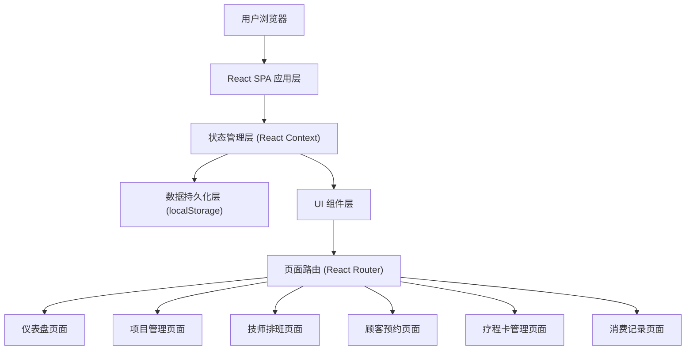
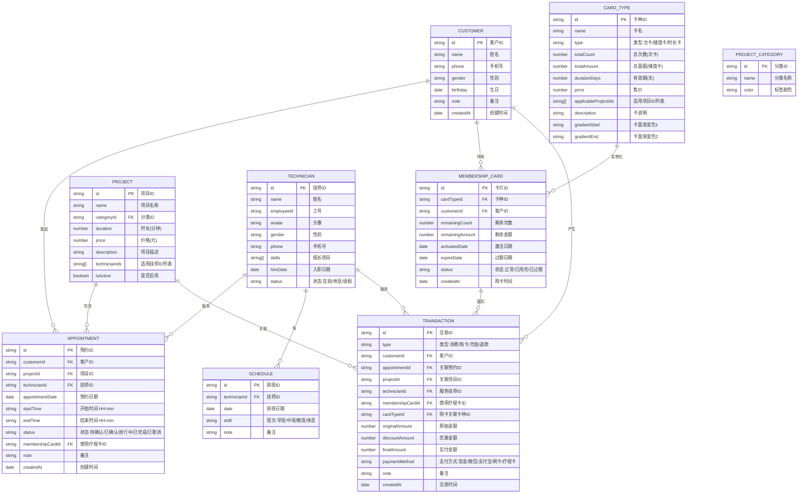

# 理疗馆预约排钟系统 - 技术架构文档

## 1. 架构设计

本系统采用纯前端单页应用（SPA）架构，使用 React 构建用户界面，通过 localStorage 进行本地数据持久化，内置丰富的 mock 数据保证开箱即用。



## 2. 技术说明

- **前端框架**：React@18（函数式组件 + Hooks）
- **构建工具**：Vite@5（快速热更新、按需编译）
- **样式方案**：TailwindCSS@3（原子化 CSS + 自定义主题）
- **路由管理**：React Router DOM@6（声明式路由）
- **状态管理**：React Context + useReducer（轻量级全局状态）
- **图表库**：Recharts（React 生态图表库，支持折线图/柱状图/饼图）
- **图标库**：Lucide React（线性图标，风格简洁统一）
- **日期处理**：date-fns（轻量级日期工具库）
- **UI 交互**：Framer Motion（页面过渡动画、微交互动效）
- **后端服务**：无（纯前端架构，使用 localStorage 模拟后端）
- **数据存储**：localStorage（浏览器本地持久化存储）
- **数据种子**：内置丰富 mock 数据，启动即可体验完整功能

## 3. 路由定义

| 路由路径 | 页面组件 | 功能说明 |
|----------|----------|----------|
| `/` | `Dashboard` | 首页仪表盘：数据概览、今日时间轴、快捷操作 |
| `/projects` | `ProjectManagement` | 项目管理：项目 CRUD、分类管理 |
| `/schedule` | `TechnicianSchedule` | 技师排班：排班日历、技师管理、班次配置 |
| `/appointments` | `AppointmentManagement` | 顾客预约：预约列表、预约登记、状态管理 |
| `/memberships` | `MembershipManagement` | 疗程卡管理：卡种配置、购卡办理、客户卡片 |
| `/transactions` | `TransactionRecords` | 消费记录：流水列表、账单详情、统计图表 |

## 4. 数据模型与存储

### 4.1 数据模型 ER 图



### 4.2 数据初始化方案

- 首次加载时检测 localStorage 是否存在数据
- 若不存在，注入 mock 种子数据（30+ 条记录覆盖各业务场景）
- 每次数据变更自动同步至 localStorage
- 提供"重置数据"功能一键恢复初始状态

## 5. 目录结构

```
src/
├── assets/               # 静态资源（图片、字体）
├── components/           # 通用组件
│   ├── Layout/           # 布局组件（侧边栏、头部、内容容器）
│   ├── common/           # 通用UI组件（Button、Modal、Table、Badge等）
│   └── charts/           # 图表组件
├── context/              # 全局状态 Context
│   ├── AppContext.jsx    # 根 Context Provider
│   ├── CustomerContext.jsx
│   ├── ProjectContext.jsx
│   ├── TechnicianContext.jsx
│   ├── AppointmentContext.jsx
│   ├── MembershipContext.jsx
│   └── TransactionContext.jsx
├── pages/                # 页面组件
│   ├── Dashboard.jsx
│   ├── ProjectManagement.jsx
│   ├── TechnicianSchedule.jsx
│   ├── AppointmentManagement.jsx
│   ├── MembershipManagement.jsx
│   └── TransactionRecords.jsx
├── data/                 # Mock 种子数据
│   └── seedData.js
├── styles/               # 全局样式
│   └── index.css         # Tailwind + 自定义主题变量
├── utils/                # 工具函数
│   ├── storage.js        # localStorage 封装
│   ├── dateUtils.js      # 日期处理
│   └── helpers.js        # 通用工具
├── App.jsx               # 根组件（路由配置）
└── main.jsx              # 入口文件
```

## 6. 主题配置（TailwindCSS）

```js
// tailwind.config.js
{
  theme: {
    extend: {
      colors: {
        sandalwood: {
          50:  '#FBF6F0',
          100: '#F2E6D8',
          200: '#E6CDB2',
          300: '#D4AE87',
          400: '#BE8A5C',
          500: '#A86F42',
          600: '#8A5734',
          700: '#6B4423', // 主色 - 深檀木色
          800: '#55361C',
          900: '#3F2815',
        },
        jade: {
          50:  '#F2F8F2',
          100: '#E0EEE0',
          200: '#BFDDBE',
          300: '#97C696',
          400: '#6FAD6D',
          500: '#5B8C5A', // 辅色 - 玉石绿
          600: '#4A7249',
          700: '#3B5A3A',
          800: '#2E462D',
          900: '#233522',
        },
        gold: {
          400: '#D9BE88',
          500: '#C9A961', // 点缀色 - 暖金色
          600: '#B09047',
        },
        cream: {
          50:  '#FDFBF8',
          100: '#FAF7F2', // 背景色 - 米色
          200: '#F3EEE4',
        },
        ink: {
          600: '#4A463F',
          700: '#3A3732',
          800: '#2D2A26', // 文字色 - 墨灰
          900: '#1E1C19',
        }
      },
      fontFamily: {
        serif: ['"Source Han Serif CN"', '"Noto Serif SC"', 'SimSun', 'serif'],
        sans: ['"Source Han Sans CN"', '"Noto Sans SC"', '"Microsoft YaHei"', 'sans-serif'],
      },
      boxShadow: {
        'card': '0 2px 12px rgba(107, 68, 35, 0.06)',
        'card-hover': '0 8px 24px rgba(107, 68, 35, 0.12)',
        'modal': '0 16px 48px rgba(45, 42, 38, 0.18)',
      },
      keyframes: {
        'fade-up': {
          '0%': { opacity: '0', transform: 'translateY(8px)' },
          '100%': { opacity: '1', transform: 'translateY(0)' },
        },
        'fade-in': {
          '0%': { opacity: '0' },
          '100%': { opacity: '1' },
        },
      },
      animation: {
        'fade-up': 'fade-up 0.3s ease-out',
        'fade-in': 'fade-in 0.25s ease-out',
      },
    }
  }
}
```
